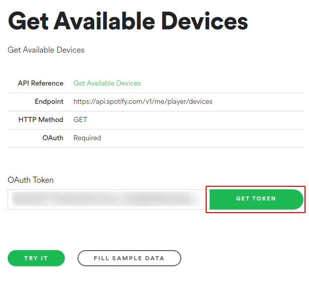
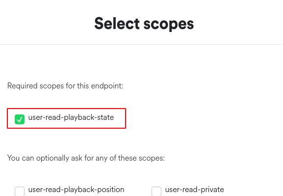
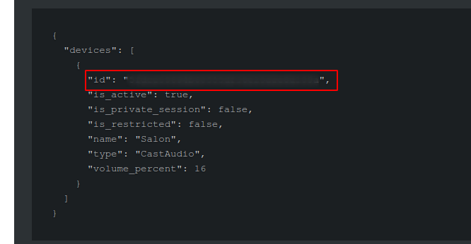

[](https://github.com/custom-components/hacs)
[](https://github.com/fondberg/spotcast)


[](https://www.buymeacoffee.com/fondberg)

# Spotcast

Home Assistant custom component to start Spotify playback on an idle chromecast device or a Spotify Connect device (thanks to @kleinc80) which means that you can target your automation for chromecast as well as connect devices.

This component is not meant to be a full Spotify chromecast media_player but only serves to start the playback. Controlling the chromecast device and the Spotify playback after the initial start is done in their respective components.
Because starting playback using the API requires more powerful token the username and password used for browser login is used.

Used by [Spotify-Card](https://github.com/custom-cards/spotify-card).

__[Community post](https://community.home-assistant.io/t/spotcast-custom-component-to-start-playback-on-an-idle-chromecast-device/114232)__

## Installation

### HACS

This component is easiest installed using [HACS](https://github.com/custom-components/hacs).

### Manual installation

Copy all files from custom_components/spotcast/ to custom_components/spotcast/ inside your config Home Assistant directory.

## Configuration

### Minimum Home Assistant version

Spotcast is compatible with any version since 2021.12.0.

### Official Spotify Integration

Note that as of v3.5.2 you must also have the official [Home Assistant Spotify Integration](https://www.home-assistant.io/integrations/spotify/) installed and configured for this custom component to work. This is because it provides the correct device list which has the correct scopes in its token.

### Obtaining `sp_dc` and `sp_key` cookies

Spotcast uses two cookies to authenticate against Spotify in order to have access to the required services.

To obtain the cookies:

* Using Chrome or Edge

>* Open url [`chrome://settings/cookies/detail?site=spotify.com`](chrome://settings/cookies/detail?site=spotify.com)
>* If no cookies appear go to [`https://open.spotify.com`](https://open.spotify.com) and sign-in
>* Copy content from `sp_dc` and `sp_key` cookies

* Using another browser

>* Use a browser extension like "Export cookies" and look for `sp_dc` and `sp_key` cookies

or

>* Open a new __Incognito window__ at [https://accounts.spotify.com/en/login?continue=https:%2F%2Fopen.spotify.com%2F](https://accounts.spotify.com/en/login?continue=https:%2F%2Fopen.spotify.com%2F)
>* Open Developer Tools in your browser (might require developer menu to be enabled in some browsers)
>* Login to Spotify
>* Search/Filter for `get_access_token` in Developer tools under Network.
>* Under cookies for the request save the values for `sp_dc` and `sp_key`
>* Close the window without logging out (Otherwise the cookies are made invalid)
>
>

* Alternatively you can use a browser plugin like "Export cookies".

### Single account

Add the following to your configuration.yaml:

```yaml
spotcast:
  sp_dc: !secret sp_dc
  sp_key: !secret sp_key
  country: SE #optional, added in 3.6.24
```

### Multiple accounts

Add `accounts` dict to the configuration and populate with a list of accounts to
be able to initiate playback using diffferent accounts than the default.

If you are using v3.5.2 or greater and thus also have the core Spotify Integration installed, then [the additional accounts will also need to be added there as well](https://www.home-assistant.io/integrations/spotify#using-multiple-spotify-accounts) for multiple accounts to work.

```yaml
spotcast:
  sp_dc: !secret primary_sp_dc
  sp_key: !secret primary_sp_key
  country: SE #optional, added in 3.6.24
  accounts:
    niklas:
      sp_dc: !secret niklas_sp_dc
      sp_key: !secret niklas_sp_key
    ming:
      sp_dc: !secret ming_sp_dc
      sp_key: !secret ming_sp_key
```

## Call the service

The spotcast custom component creates a service called 'spotcast.start' in Home Assistant.

### Start playback on Spotify connect device

```json
{
  "spotify_device_id" : "ab123c5d7347324c2b1234567890f8d6dc40350",
  "uri" : "spotify:playlist:37i9dQZF1DX3yvAYDslnv8",
  "random_song": true
}
```

### Start playback on a device with default account

```json
{
  "device_name" : "Kök",
  "uri" : "spotify:playlist:37i9dQZF1DX3yvAYDslnv8",
  "random_song": true
}
```

where:

* `spotify_device_id` is the device ID of the Spotify Connect device
* `device_name` is the friendly name of the chromecast device
* `uri` is the Spotify uri, supports all uris including track (limit to one track)
* `search` is a search query to resolve into a uri. This parameter will be overlooked if a uri is provided
* `category` let spotify pick a random playlist inside a given [category](https://developer.spotify.com/console/get-browse-categories/)
* `country` restrict country to use when looking for playlists inside a category
* `limit` restrict number of playlists to return when looking in a category. Note that only a single playlist will be chosen randomly from them.
* `random_song` optional parameter that starts the playback at a random position in the playlist
* `repeat` optional parameter that repeats the playlist/track
* `shuffle` optional parameter to set shuffle mode for playback
* `offset` optional parameter to set offset mode for playback. 0 is the first song

Optionally you can specify the `entity_id` of an existing Home Assistant chromecast media-player like:

```json
{
  "entity_id" : "media_player.vardagsrum",
  "uri" : "spotify:playlist:37i9dQZF1DX3yvAYDslnv8"
}
```

### Find Spotify Device ID

To use the Spotcast service with a Spotify Connect device, you need the `spotify_device_id`. To find the `spotify_device_id`, multiple option are available.

#### With Spotify developper portal

1. Go to [Spotify developper console](https://developer.spotify.com/console/get-users-available-devices/)
2. Click `GET TOKEN` <br/>

3. Select `user-read-playback-state` as a scope<br/>

4. If prompt give permission to your Spotify profile
5. For chromecast devices, make sure to play media on the device prior to checking the logs as they will not show unless active
6. Press the option `Try it`
7. Read the result in the console in the right.<br/>


#### Through Spotcast log

1. Enable the debug logs (instructions are in section `Enabling Debug Log` in this README)
2. Reboot Home Assistant
3. Go to `Configuration >> Logs >> Load Full Home Assistant Log`.
4. For chromecast devices, make sure to play media on the device prior to checking the logs as they will not show unless active
5. Find the log entry `get_spotify_devices` and look for the device ID.

#### Sonos Device ID

1. Open the Spotify Web Player and sign in if needed
2. Make sure you see your Sonos devices in the Connect popup
3. Open your browser's DevTools (F12 for Chrome)
4. Navigate to the Network tab
5. Connect to the desired Sonos device in the Web Player
6. Find the associated request in your DevTools
7. The request URL looks something like this: `https://gew1-spclient.spotify.com/connect-state/v1/connect/transfer/from/my_web_player_device_id/to/my_sonos_device_id`
8. The `my_sonos_device_id` is the `spotify_device_id` you are looking for.

##### Log exemple

```LOG
2022-01-13 19:10:35 DEBUG (SyncWorker_0) [custom_components.spotcast.helpers] get_spotify_devices: media_player.spotify_felix: Spotify Félix Cusson: [{'id': '################################', 'is_active': True, 'is_private_session': False, 'is_restricted': False, 'name': 'Salon', 'type': 'CastAudio', 'volume_percent': 16}]
2022-01-13 19:10:35 DEBUG (SyncWorker_0) [custom_components.spotcast.helpers] get_spotify_devices: {'devices': [{'id': '###############################', 'is_active': False, 'is_private_session': False, 'is_restricted': False, 'name': 'Salon', 'type': 'CastAudio', 'volume_percent': 16}]}

# Look for
<...> Spotify Félix Cusson: [{'id': '################################', <- This is the device ID
```

### Automation example

```yaml
- id: 'jul_spotify_spela_julmusik'
  alias: Jul spela julmusik
  initial_state: 'on'
  trigger:
  - event_data:
      id: remote_fonsterlampor
      event: 5002
    platform: event
    event_type: deconz_event
  condition: []
  action:
  - data:
      uri: 'spotify:playlist:56Bor5fbMJlJV7oryb2p3k'
      random_song: true
      shuffle: true
      start_volume: 50
      entity_id: media_player.gh_kok
    service: spotcast.start
```

```yaml
- service: spotcast.start
  data:
    search: "Brown Bird"
    # resolve to spotify:artist:5zzbSFZMVpvxSlWAkqqtHP at the time of writing
    random_song: true
    shuffle: true
    start_volume: 50
    entity_id: media_player.cuisine
```

### Transfer current playback for the account

Omitting `uri` will transfer the playback to the specified device.

```json
{
  "device_name" : "Högtalare uppe"
}
```

Use the parameter `force_playback` to continue the user's playback even if nothing is currently playing.

```json
{
  "device_name" : "MultiRoom",
  "force_playback" : true
}
```

where:

* `device_name` is the friendly name of the chromecast
* `force_playback` (optional) true or false, true to continue the user's playback even if nothing is currently playing

### Start playback on a device with non default account

```json
{
  "account":"niklas",
  "device_name" : "Kök",
  "uri" : "spotify:playlist:37i9dQZF1DX3yvAYDslnv8"
}
```

where:

* `account` is the name of account key in the accounts dictionary in the configuration
* `device_name` is the friendly name of the chromecast
* `uri` is the Spotify uri, supports all uris including track (limit to one track)

#### start podcast playack

Play the latest episode of a given podcast show.

```json
{
  "account":"niklas",
  "device_name" : "Kök",
  "uri" : "spotify:show:6PeAI9SHRZhghU7NRPXvT3",
  "ignore_fully_played": true
}
```

where

* `account` is the name of account key in the accounts dictionary in the configuration
* `device_name` is the friendly name of the Chromecast
* `uri` is the spotify uri, (podcasts use the 'show' uri)
* `ignore_fully_played` (optional) true or false, true to ignore already fully played episodes (defaults to false and play the latest released episode)

## Use the sensor

The sensor has the discovered chromecasts as both json and an array of objects.
Since v3.4.0 it does not do its own discovery but relies on data from core cast.
Add the following to the sensor section of the configuration:

```yaml
sensor:
  - platform: spotcast
    country: SE
```

The country tag was added in v3.6.24. This tag is optional. If ommited or if you haven't updated the configuration since the update, it will default to "SE" (which it always did before)

Sensor name:

```yaml
sensor.chromecast_devices
```

Attributes

```json
devices_json: [
  {
    "name": "Kök",
    "cast_type": "audio",
    "model_name": "Google Home",
    "uuid": "xxxxx",
    "manufacturer": "Google Inc."
  },
  {
    "name": "Högtalare uppe",
    "cast_type": "group",
    "model_name": "Google Cast Group",
    "uuid": "xxxx",
    "manufacturer": "Google Inc."
  },
  {
    "name": "Vardagsrum",
    "cast_type": "cast",
    "model_name": "HK Citation 300",
    "uuid": "xxxx",
    "manufacturer":"Harman Kardon"
    }
  ]

last_update: 2019-05-01T15:27:49.828553+02:00

friendly_name: Chromecast Devices
```

## Websocket API

The components websocket api.

Method: `spotcast/playlist` supporting different `playlist_type`s.

* `user`, or `default` for user chosen saved playlists
* `featured` for spotify "featured" playlists (not personalized)
* `discover-weekly` for personalized "Made for _____" (includes daily mixes)
* `recently-played` for "Recently Played"
* ... any other `view id` as found in the API at [https://api.spotify.com/v1/views/personalized-recommendations](https://api.spotify.com/v1/views/personalized-recommendations)

Example usage:

```python
// Retrieve playlists
const res = await this.props.hass.callWS({
  type: 'spotcast/playlists',
  playlist_type: 'featured', // 'user' for saved playlists, 'featured' for spotify featured, or personalized view id
  country_code: 'SV', // Optional country code used by featured playlists
  limit: 20, // Optional limit, default is 10
  account: 'ming' // optional account name
});

// Retrieve devices
const res = await this.props.hass.callWS({
  type: 'spotcast/devices',
  account: 'ming' // optional account name
});

// Retrieve player
const res = await this.props.hass.callWS({
  type: 'spotcast/player',
  account: 'ming' // optional account name
});
```

## Enabling debug log

In configuration.yaml for you HA add and attach those the relevant logs.
Be sure to disable it later as it is quite noisy.

```yaml
logger:
  default: info
  logs:
    custom_components.spotcast: debug
```

## Donate

If you like what I do and want to support me - I love coffee!

<a href=
  "https://www.buymeacoffee.com/fondberg" target="_blank">
  
</a>

## Contribute

Please do! Open a Pull Request with your improvements.

## License

Apache 2.0
